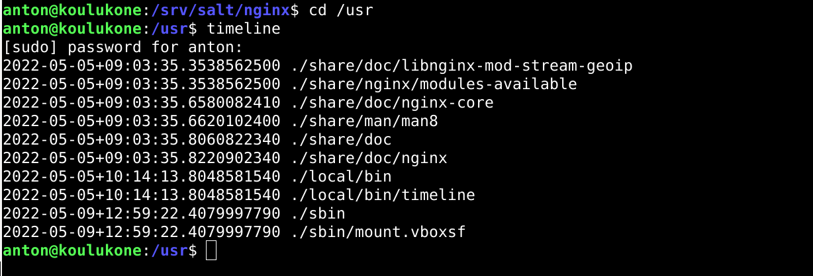

# starterkit

- Tekijä: Anton Lagerstedt
- Versio: alpha
- Lisenssi: GNU GENERAL PUBLIC LICENSE Version 2

Tämän projektin tarkoitus on asentaa uudelle Linux-koneelle hyväksi havaitsemani ohjelmat ja niiden asetukset, siltä osin kuin olen tehnyt niihin muutoksia. Lisäksi asennetaan muutama tekemäni komento kaikille käyttäjille.

Alustavat lista asennettavista ohjelmista.

- Micro (tekstieditori)
- Vlc (videosoitin
- Gimp (kuvankäsittelyohjelma)
- Apache (verkkopalvelin)

Asennetaan myös "timeline"-komento, joka näyttää aikajanan muutoksista kansiossa, jossa komento ajetaan.
Esimerkki timelina komennosta:

